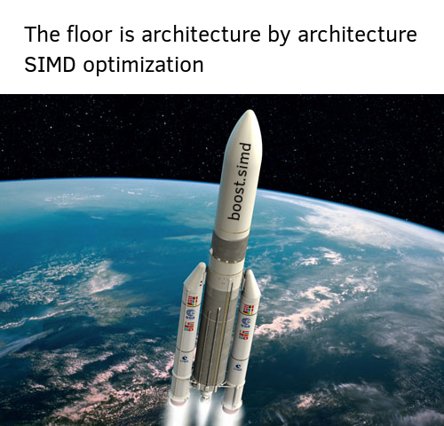

# boost.simd_playground



This is just a public repo to keep an online backup of my work at the LRI. The roadmap is detailed [here](./TODO.md).

You'll also find my dev blog about the project [here](http://www.penuch.it/boost.simd_playground/), which is basically a compilation of benchmarks, insights and remarks about [boost.simd](https://github.com/NumScale/boost.simd).

## Installation/Dependencies

The main requirements are :

-	CMake
-	NPM

To get the project ready to build simply execute ```./prepare``` and all the dependencies will be downloaded automatically.

## Featured work

The project's goal is to develop some basic algebra functions like dot product, gemm and gemv using boost.simd to make a series of benchmarks and code inspection. Ultimately we compare ourselves with OpenBLAS as it features handcrafted assembly code for each architecture. To make it short : the goal is to compare boost.simd's approach (Atomic SIMD abstraction thanks to boost.simd, generic code for everything else) with OpenBLAS' approach (Assembly code tailored to each major CPU architecture).

Multiple versions of thte "dot_simd" functions have been made and kept under ```algebra/dot/dot_versions.hpp```, which enables us to have a look at the impact of small tweaks on the generated code using the ```compare/``` folder, which is just a project that automatically compiles and dumps assembly code. Set up Sublime Text in a 4 panel view and you *might* even forget compiler-explorer. :sunglasses:

Basic types :

- ```jp::pvector``` : Simply an std::vector that uses boost.simd's aligned allocator. Nothing more, nothing less.
- ```jp::parray``` (Deprecated..?) : Inherits std::array, optimally aligned

Both types are aligned using the default size of a boost::simd::pack to match with the size of the SIMD registers of the CPU the program is being compiled for.

## Examples

##### Warning

The library is still being worked on and these examples might be unusable in 10 minutes.

### Dot product

Using boost.simd optimized kernel :

```C++
#include <iostream>
#include <numeric>

#include <jpenuchot/pvector.hpp>
#include <jpenuchot/algebra/dot/dot.hpp>

int main(){
	jp::pvector<float> pvec(8 << 10);
	std::iota(pvec.begin(), pvec.end(), 0);
	auto y = jp::algebra::dot_simd(pvec, pvec);
	std::cout << y << '\n';
}
```

Using cblas :

```C++
#include <iostream>
#include <numeric>

#include <jpenuchot/pvector.hpp>
#include <cblas.h>


int main(){
	jp::pvector<float> pvec(8 << 10);
	std::iota(pvec.begin(), pvec.end(), 0);
	auto y = cblas_sdot(8 << 10, pvec.data(), 1, pvec.data(), 1);
	std::cout << y << '\n';
}
```

NB : Lib name/namespaces will be refactored later. Putting my name everywhere started out as a joke but it's becoming quite awkward...
