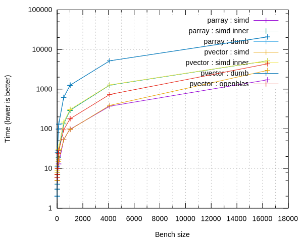
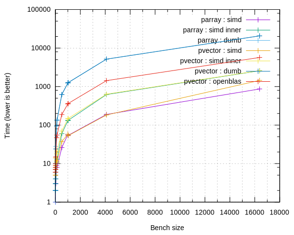
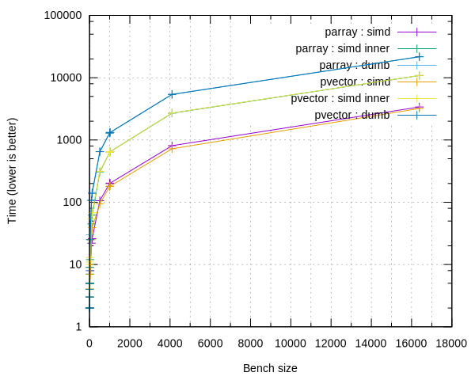
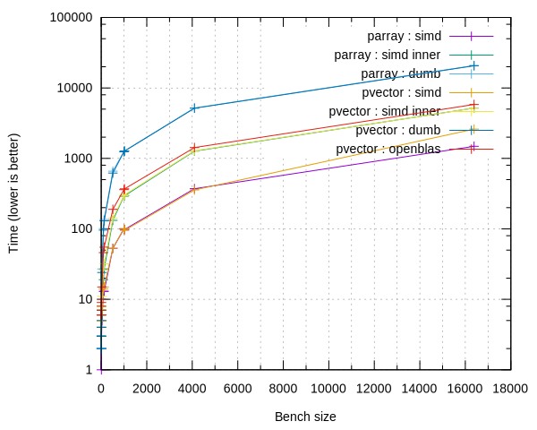

# [~devblog](../)/benches

There you have some benchmark comparisons between "dumb" methods (No SIMD optimization) and the other ones : using SIMD inner product with boost.simd's ```segmented_aligned_range``` and a manually unrolled one (That is not optimized for small sizes... Yet).

Specs :

- Dell XPS 9350
- Intel(R) Core(TM) i7-6560U CPU @ 2.20GHz

**Warning :** These metrics are temporary and the OpenBLAS benchmark might be biaised as it comes from Solus' repository and wasn't necessarily compiled specifically for this configuration.

## AVX - double



Units :

- Time in nanoseconds
- Bench size in number of elements

## AVX float



Units :

- Time in nanoseconds
- Bench size in number of elements

## SSE 4.2 - double



Units :

- Time in nanoseconds
- Bench size in number of elements

## SSE 4.2 - float



Units :

- Time in nanoseconds
- Bench size in number of elements
