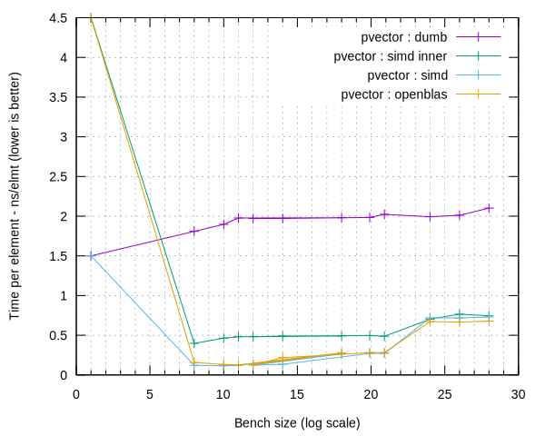
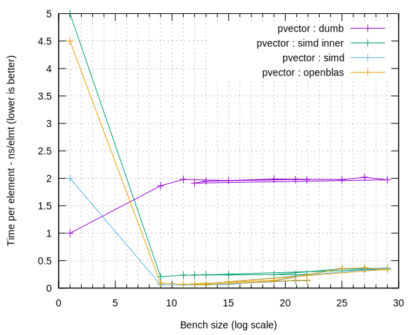
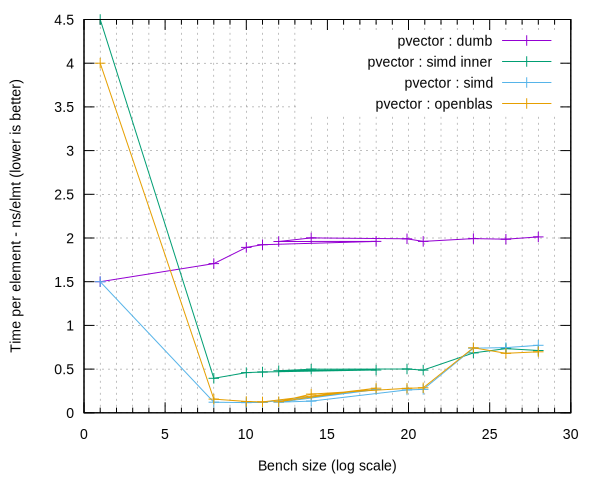
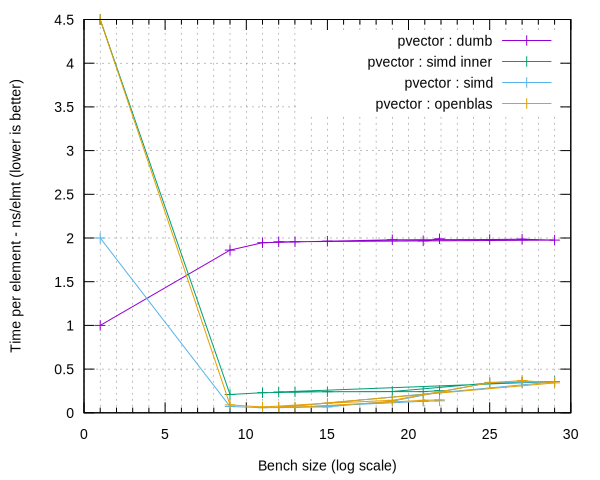

# [~devblog](../)/benches

There you have some benchmark comparisons between "dumb" methods (No SIMD optimization) and the other ones : using SIMD inner product with boost.simd's ```segmented_aligned_range``` and a manually unrolled one (That is not optimized for small sizes... Yet).

##### Specs :

- Microsoft Azure instance
- Intel(R) Xeon(R) CPU E5-2673 v3 @ 2.40GHz (2 cores, single-threaded load)

##### Benchmark details

The benchmark was tailored to this specific CPU so each group of 3 benchmarks fits in a specific cache level : the first ones fit in the L1d cache, the next ones fit in the L2 cache, and so on.

OpenBLAS was compiled for this machine and each benchmark was also compiled with the -mfma option using GCC 5.4.0.

"dumb" version corresponds to a simple std::inner_product, "simd" is the best we could get using only boost.simd and no custom assemly code, "simd inner" is a boost.simd optimized version that simply uses boost::inner_product on a pair of boost::simd::segmented_aligned_range (aka the cleanest way to write the dot product with SIMD optimization) and "openblas" is the OpenBLAS version with custom ASM code for this architecture.

### AVX - double



Units :

- Time per element in nanoseconds
- Bench size in number of elements

### AVX float



Units :

- Time per element in nanoseconds
- Bench size in number of elements

### SSE 4.2 - double



Units :

- Time per element in nanoseconds
- Bench size in number of elements

### SSE 4.2 - float



Units :

- Time per element in nanoseconds
- Bench size in number of elements

## Maths

Now comes the part where we calculate two values : the peak FLOPS, and the max FLOP/cycle values for each version of the dot product, which is reached for a pvector of 2048 elements (Data available [here](https://github.com/JPenuchot/boost.simd_playground/tree/gh-pages/benches/content)) :

```
res += a[i] * b[i] -> *, += -> 2 floating point operations per element

Which is a total of 4096 floating point operations for an interation of the dot product

Let T be the time of a dot product iteration expressed in seconds
Let F = 2.4 * 10^9 be the frequency of the CPU in Hz

The compute time for one element of a vector would be T / 2048,
The number of computed elements per second would be 2048 / T,
The number of floating point operations per second would then be Fs = 2 * 2048 / T = 4096 / T

Then the number of floating point operations per cycle would be Fc = Fs / F
```

### Dumb (std::inner_product)

```
T = 4056 * 10^-9 s
Fs = 1.01 GFLOPS
Fc = .420 FLOP/Cycle
```

### OpenBLAS

```
T = 141 * 10^-9 s
Fs = 29.0 GFLOPS
Fc = 12.1 FLOP/Cycle
```

### SIMD (inner product)

```
T = 485 * 10^-9 s
Fs = 8.45 GFLOPS
Fc = 3.69 FLOP/Cycle
```

### SIMD (manual 4x loop unroll)

```
T = 119 * 10^-9 s
Fs = 34.4 GFLOPS
Fc = 14.3 FLOP/Cycle
```
